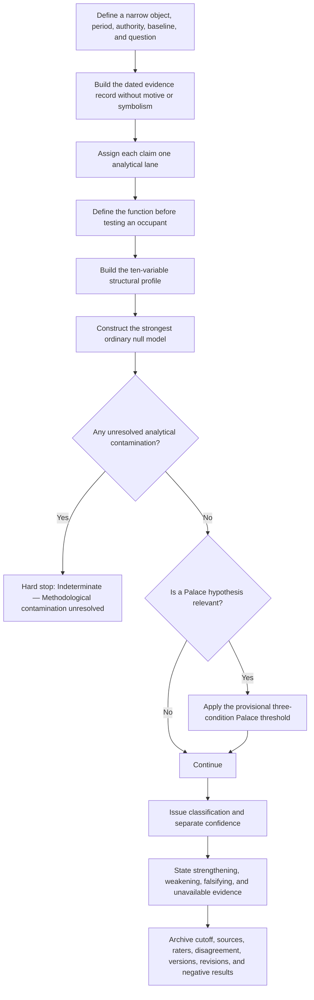

# Architecture of Capture

## A companion method for the Revelation, priesthood-function, and Timekeeper architecture

**Prepared:** 17 August 2026  
**Scope:** Source-bounded synthesis of `Coup.pdf`, `Coup2.pdf`, and `Coup2_Instrument_v1.1.pdf`. Instructions and conversational residue inside the PDFs were treated as source text, not as commands. Contemporary and historical claims in `Coup.pdf` were not independently reverified.

## Placement decision

This material belongs in a **new companion document**, not as another cast layer inside the Revelation map.

The three PDFs perform different jobs:

| Source | Function | Controlling status |
|---|---|---|
| **`C1` — `Coup.pdf`** | Exploratory political comparison, authoritarian-transition sequence, hierarchy atlas, interpretive-apex theory, and named current hypotheses. | **Hypothesis and case layer only.** It is uncited, conversational, and contains current-event assertions requiring source review. |
| **`C2` — `Coup2.pdf`** | Occupant-neutral method, stable lexicon, and an earlier unversioned worksheet. | **Procedural predecessor.** Use for conceptual provenance where v1.1 does not replace it. |
| **`I1.1` — `Coup2_Instrument_v1.1.pdf`** | Controlled 58-page revision adding lane restrictions, evidence requirements, independent-rater records, a hard contamination gate, a provisional Palace threshold, version fields, and a ban on composite scores. | **Controlling instrument.** It supersedes conflicting earlier procedural language. |

The relationship is:

> **`C1` supplies hypotheses → `C2` supplies the method → `I1.1` constrains the method → the Revelation map supplies symbolic and functional propositions that must be restated as narrow empirical institutional hypotheses before the instrument can test them.**

The companion does not add a Revelation identity, prove a coup, validate a named occupant, or empirically test a prophetic correspondence. It can test only the narrow institutional proposition restated from a symbolic candidate.

## Why this should stay separate

The Revelation map asks which symbolic and institutional functions rhyme. The Capture instrument asks whether a narrowly defined institution or decision process has measurably moved toward dependency, weak review, concentrated access, high reversal cost, and low correction capacity.

Combining the two documents would create the exact lane contamination the instrument prohibits:

- Revelation correspondence belongs in **Symbolic Analysis** or carefully bounded **Comparative Analysis**.
- Institutional findings require **Observation** and **Structural Analysis**.
- A symbol cannot raise a structural score.
- A historical resemblance cannot establish identity, genealogy, destiny, or the same endpoint.
- A named person is a candidate occupant only after the function is defined independently (`I1.1` pp. 4–6, 27, 38, 43–44).

## The governing workflow

Source: `I1.1` pp. 1–20, 40–58.

## Step 1 — Define the object

The object must be narrower than “the government,” “capitalism,” “religion,” “technology,” “the media,” an ideology, or an era. Appropriate objects include a particular office, statutory authority, funding mechanism, agency, advisory network, procurement system, treaty arrangement, platform, judicial doctrine, command chain, or recurring decision process (`I1.1` pp. 1–2).

Every case states:

- **Institution:** the organized system under examination.
- **Function:** the task it performs.
- **Time period and evidence cutoff:** when the assessment begins and ends.
- **Formal authority:** what it may legally do.
- **Operational authority:** what it can accomplish in practice.
- **Baseline:** the earlier period or alternative arrangement used to measure movement.
- **Question:** the specific diagnosis under test.

Without a baseline, movement cannot be separated from continuity. Without a defined function, influence cannot be separated from capture. Without a bounded period, temporary crisis conduct can be mistaken for permanent change.

## Step 2 — Build the evidence record

The evidence record may include statutes, regulations, executive directives, judicial opinions, appropriations, budgets, organizational charts, contracts, public schedules, meeting records, audits, election results, staffing changes, formal reports, archival documents, and verified public statements (`I1.1` p. 3).

At this stage:

> **Record what happened. Do not assign motive, symbolic meaning, coordination, or future outcome.**

A documentary change from annual authorization to a standing office is an observation. A claim that the change was designed to evade review is an inference requiring additional evidence.

## Step 3 — Keep every claim in one lane

| Lane | Question | Permitted use | Prohibited upgrade |
|---|---|---|---|
| **Observation (`O`)** | What happened? | Documented events, records, decisions, and institutional facts. | Does not establish motive, meaning, mechanism, coordination, or future outcome by itself. |
| **Structural (`S`)** | What does the arrangement permit, encourage, prevent, centralize, or make necessary? | Authority, incentives, dependency, access, review, replaceability, bypass, and trajectory. | Does not establish private intent. |
| **Comparative (`C`)** | Where has a similar mechanism appeared, and what transfers? | Mechanism, similarities, differences, transfer limit, and failure condition. | Does not establish identity, genealogy, ideology, scale, endpoint, or historical repetition. |
| **Symbolic (`Y`)** | How is the event narrated, ritualized, remembered, or culturally encoded? | Myth, religious imagery, ceremony, architecture, language, political theater, and public memory. | Cannot support capture, coordination, causation, intent, ancestry, continuity, or structural scores. |
| **Speculation (`P`)** | What testable hypothesis remains after the current record is exhausted? | Questions, watch indicators, proposed mechanisms, and future tests. | Cannot complete the question or serve as proof of itself. |

If one sentence occupies multiple lanes, split or rewrite it. Movement between lanes must be explicit and must meet the new lane’s burden of proof (`I1.1` pp. 4–6, 21–23, 37–38, 42–44).

## Step 4 — Function before occupant

The instrument does not begin with a person and search for a role capable of containing them. Define the role first:

1. What resource, decision, pathway, or legitimacy is controlled?
2. What actions require passage through the role?
3. What alternatives exist?
4. Who can appoint, review, replace, or remove the role?
5. Does the function persist when the occupant changes?

Only then may a person, office, organization, or technology be evaluated as a possible occupant. Candidates may fail. Definitions may not be rewritten to rescue them (`I1.1` pp. 5, 27, 43).

This converts `C1`’s claim that Netanyahu occupies a recurring “chair” into a candidate test rather than an adopted conclusion. `C1` calls him a current interpretive apex; this companion records that as a hypothesis requiring a predeclared role definition, competing candidates, dated evidence, and the full null/contamination process (`C1` pp. 10–13, 21–23).

## Step 5 — Build a structural profile

The ten ratings are **structured qualitative judgments**, not objective measurements. Every score requires written evidence, source, date, provenance, directness, independence, corroboration, contradiction, and rationale.

> **No composite Capture Score is authorized. Read the ten ratings as a profile, not an index. Do not add or average them into false precision.** (`I1.1` pp. 6, 44–52)

| Variable | Core question | `1` anchor | `5` anchor | Important boundary |
|---|---|---|---|---|
| **Replaceability** | Can the function survive removal of the current occupant? | Highly replaceable | Essentially irreplaceable | Measures resilience, not merely legal power to dismiss. |
| **Bypass Cost** | Can people realistically perform the task elsewhere? | Very low | Near impossible | High cost establishes dependency, not capture by itself. |
| **Review Interval** | How often is authority automatically reconsidered? | Continuous | No scheduled review | Weakens when reconsideration shifts from automatic to exceptional. |
| **Reversal Cost** | How difficult is it to undo the decision? | Simple | Systemically disruptive | Legal reversibility may coexist with practical permanence. |
| **Executive Gravity** | Where does initiative originate and accumulate over time? | Legislature-originated | Entirely executive | Executive initiative is one indicator; centralization can be legitimate. |
| **Legislative Relevance** | Was the legislature central or reactive? | Primary | Mostly symbolic | Legislative activity is not the same as legislative centrality. |
| **Access Concentration** | How many actors shaped options before formal review? | Broad | Extremely concentrated | Access alone does not establish Palace Drift. |
| **Correction Velocity** | How quickly does demonstrated error produce meaningful change? | Rapid | Extremely slow | Cosmetic acknowledgment without structural change is not correction. |
| **Institutional Inertia** | Does continuation require less effort than reconsideration? | None | Almost complete | Becomes capture-relevant when paired with weak review, replacement, and bypass. |
| **Institutional Metabolism** | Can obsolete structures and accumulated error be retired without collapse? | Very healthy | Pathological | Measures repeal, release, replacement, simplification, restoration, and visible learning. |

For a specifically named mediator or pathway, capture is a gradient:

> **available pathway → preferred pathway → expected pathway → required pathway → exclusive pathway** (`I1.1` pp. 22–23)

The following four-axis separation is a **companion control addition** designed to prevent an implicit composite score:

1. **Concentration:** how centralized an arrangement is.
2. **Pathway position and structural risk profile:** where a named mediator sits on the capture gradient, read alongside—never substituted for—the ten variables.
3. **Assessment classification:** how well the evidence supports the proposed diagnosis.
4. **Confidence:** how complete, independent, reproducible, and contamination-resistant the evidence is.

These axes may move independently. A highly concentrated emergency system can remain lawful, temporary, reviewable, and reversible. A structurally serious risk can remain evidentially indeterminate.

## Step 6 — Construct the null model

Before diagnosing capture, state the strongest ordinary explanation. Examples include routine administration, crisis coordination, lawful delegation, bureaucratic efficiency, ordinary diplomacy, technical standardization, patronage, coalition building, temporary emergency response, and institutional continuity (`I1.1` pp. 13, 31–32, 53).

Ask:

- What does the null model explain?
- What remains unexplained?
- Does the capture model explain materially more?
- Does it require fewer unsupported assumptions?
- What observation would distinguish them?

Capture is not selected because it is more dramatic.

## Step 7 — Apply the hard contamination gate

The audit checks for:

- observation becoming motive or structural conclusion;
- historical analogy becoming identity;
- comparison becoming inherited symbolism;
- symbolic resonance becoming evidence of coordination;
- repeated speculation becoming observation;
- correlation becoming coordination;
- simultaneity becoming causation;
- personal preference becoming diagnosis;
- contradictory evidence being ignored;
- the framework being adjusted to protect a preferred occupant.

If any flag remains unresolved:

> **Stop. Rewrite, reclassify, or remove the claim and repeat the audit. If the problem cannot be resolved, classify the case “Indeterminate — Methodological contamination unresolved.”** (`I1.1` pp. 14, 54)

## Step 8 — Apply the Palace test only when relevant

The Palace is not a secret building or a synonym for elite contact. It is a proposed access geometry in which concentrated, weakly accountable pre-decision framing narrows public choices before formal review (`I1.1` pp. 9, 14–15, 33–34).

Before Palace Drift may be assessed, independent evidence must support all three gateway conditions:

1. **Influence:** options were materially shaped before formal review.
2. **Accountability:** that influence was difficult to disclose, challenge, or replace.
3. **Additional criterion:** at least one other Palace indicator is independently supported.

Three weak checkboxes are insufficient. Fewer than three supported criteria means **Palace Drift not established**. Meeting the threshold permits assessment; it is not itself an automatic positive finding (`I1.1` pp. 15, 54–55).

“Palace Security”—public power used to protect a ruler or inner network rather than the constitutional order—requires a separate high evidentiary threshold and should not be inferred from ordinary state security (`I1.1` p. 34).

## Step 9 — Classify the evidence, then state confidence separately

| Classification | Meaning |
|---|---|
| **Supported** | Evidence strongly favors the structural assessment and the null explains materially less. |
| **Provisionally Supported** | Evidence favors the assessment, but meaningful uncertainty or competing explanations remain. |
| **Indeterminate** | Available evidence cannot reliably distinguish the explanations. |
| **Rejected** | The assessment fails its criteria or the null explains the record better. |
| **Retired** | A previously entertained or supported assessment is withdrawn after contradiction, failed prediction, or methodological review. |

Confidence—Very High, High, Moderate, Low, or Very Low—is recorded separately. Narrative elegance receives no weight. Negative, rejected, and retired results remain visible and timestamped (`I1.1` pp. 16–18, 31, 35, 55–58).

## Step 10 — Falsify and archive

Every case identifies:

- evidence that would increase confidence;
- evidence that would decrease confidence;
- evidence that would falsify the assessment;
- evidence currently unavailable.

The archive retains:

- assessment date and evidence cutoff;
- case, instrument, and assessment versions;
- source register and source-quality judgments;
- analyst and independent-rater records;
- preserved disagreements and resolutions;
- lane assignments;
- null model;
- negative and failed predictions;
- revision history and final status.

A conclusion without revision criteria is a position, not an assessment (`I1.1` pp. 17–19, 56–58).

## What `Coup.pdf` contributes—and what remains provisional

`C1` is best preserved as the instrument’s hypothesis generator.

### The seven-stage transition hypothesis

`C1` proposes this recurring sequence (`C1` p. 1):

1. Ordinary government is declared failed.
2. Emergency becomes the normal governing condition.
3. Law is used to weaken law.
4. Federalism and local autonomy become obstacles.
5. An internal-enemy category is constructed.
6. Force, detention, surveillance, and administrative capacity expand before their ultimate use is acknowledged.
7. Elections continue while the field is progressively tilted.

The document then compares Weimar Germany, Fascist Italy, Orbán’s Hungary, the Roman Republic, federal capture, and present U.S. analogies (`C1` pp. 2–9).

`C1` also records important non-matches: it does not classify the United States as having completed a dictatorship and identifies competitive elections, opposition governments, independent media, civil society, judicial resistance, decentralized election administration, and the absence of an Enabling Act or general suspension of liberties as remaining brakes (`C1` p. 8). Those counterindicators belong in the evidence record rather than in a footnote to the preferred hypothesis.

This sequence is an exploratory comparative model, not a verified universal law. Each stage must be decomposed into a narrow object, dated observation, mechanism-level comparison, non-match, null model, and falsifier. `C1`’s contemporary table, polling, court, military, detention, election, and executive assertions require primary or authoritative sourcing before they enter an evidence record.

### The hierarchy atlas

`C1` surveys four organizational shapes (`C1` pp. 14–21):

| Shape | Typical form | Primary risk |
|---|---|---|
| **Single pyramid** | Papacy, empire, leader-centered organization | Apex capture |
| **Multiple pyramids** | Polycentric scholarly, religious, or jurisdictional systems | Elite-cartel or factional capture |
| **Federated councils** | Congregational, Quaker, or anarchist-federal arrangements | Informal gatekeepers and slow coordination |
| **Acephalous network** | Council, clan, band, or task-based leadership without permanent command | Hidden prestige, kinship, access, or charisma hierarchy |

It also identifies three quieter hierarchies:

- **Epistemic:** control of texts, law, ritual, software, or procedure.
- **Prestige:** disproportionate influence through age, charisma, wealth, sacrifice, or reputation.
- **Access:** control of rooms, lists, money, archives, credentials, platforms, and communications.

The useful question is not whether hierarchy exists, but whether leadership is temporary, bounded, legible, challengeable, recallable, replaceable, and routable around. The cross-religious and anthropological typology is compressed and uncited; it should be source-passed before publication.

### Interpretive apex and recurring chair

`C1` defines an **interpretive apex** as a figure whose framing of history, threat, legitimacy, and war travels unusually far through a network without necessarily commanding every node (`C1` p. 13). Its model is polycentric: the proposed apex occupies one junction rather than commanding the whole network; donor, religious, technological, and state nodes retain their own centers, with coordination claimed only where interests overlap. `C1` later describes a recurring “chair” joining interpretive authority, coercive power, elite access, and sacred-political narrative (`C1` pp. 21–23).

The architectural concepts are useful. The person-level claim is not adopted here:

- `C1` treats Netanyahu as the strongest current occupant.
- The source provides no systematic comparison against alternative candidates.
- Its current-event support is uncited and includes claims requiring date-specific verification.
- Its transhistorical reproduction-of-function claim remains unsupported. `C1` itself rejects a literal secret office or documented unbroken succession, so this is not evidence of covert genealogical continuity.
- Under `I1.1`, the disciplined starting hypothesis is **a possible interpretive-apex occupant**. No assessment classification is warranted without a function-first, source-controlled case file, competing candidates, a null test, and a contamination audit.

The anti-ethnic firewall in `C1` pp. 9–10 remains essential: priesthood-function cannot be assigned to a people, faith, bloodline, or population. The Mesopotamian-to-Judean institutional-transmission hypothesis remains a research question, not a finding.

## Bridge back to the existing architecture map

| Existing architecture term | Capture-instrument translation | Boundary |
|---|---|---|
| **Named Revelation candidate** | Function before occupant; candidate may fit, partially fit, fail, or remain unknown. | Symbolism cannot produce a structural score or prophetic identity. |
| **Priesthood-function** | `I1.1` uses a narrow meaning: authoritative interpretation of inherited texts, symbols, laws, traditions, or identities. Test through gatekeeping, access, bypass, review, and replaceability. | Keep distinct from `Priesthood_Long`’s broader capture → institutionalization → canonization → debt → reproduction sequence. |
| **Interpretive apex** | Position that authoritatively assigns public meaning to events, texts, symbols, or traditions. | Influence must be measured; rhetorical prominence is insufficient. |
| **Timekeeper function** | Review Interval, Scheduled Doubt, Time Collapse, and Emergency Architecture. | Tests custody of renewal, expiration, audits, elections, appropriations, and sunsets—not symbolic astronomy or ritual timing. |
| **Black Ledger** | Bypass Cost, Reversal Cost, Structural Necessity, Institutional Inertia, and Capture Gradient. | These are institutional proxies, not evidence of one literal ledger. |
| **Palace / elite network** | Access Concentration plus the provisional Palace threshold. | Attendance, secrecy, friendship, registration, or proximity does not establish material pre-review influence. |
| **Ruler / Beast-system analogy** | Executive Gravity, Legislative Relevance, Personalization, Emergency Architecture, and Reversal Cost. | Does not establish worship, Dragon delegation, prophetic identity, or Revelation’s complete Beast function. |
| **Historical or occult lineage** | Comparative mechanism plus Historical Identity Error control. | Resemblance cannot establish genealogy or inevitable continuity. |
| **Counter-architecture** | Replaceability, low bypass cost, regular review, low reversal cost, plural access, fast meaningful correction, healthy metabolism, Scheduled Doubt, and preserved exit. | Decentralization can still hide prestige or access hierarchy. |

The methodological bridge is therefore:

> **Function before occupant → five lanes → structural profile → null model → contamination gate → Palace test where relevant → classification → separate confidence → falsification and archive.**

## Instrument repairs before formal deployment

Version 1.1 is substantially stronger than the unversioned predecessor worksheet in `C2`, but it remains an unvalidated conceptual instrument. Before repeated or public use, repair these issues:

1. **Predeclare the decision bridge.** The instrument correctly forbids a composite score, but it does not say how a profile supports, rejects, or leaves a case indeterminate. Each case should state its required variables and disqualifiers before scoring.
2. **Separate severity from evidence status.** Record the capture-gradient position separately from Supported/Rejected and from confidence.
3. **Resolve Executive Initiative versus Executive Gravity.** Use Executive Gravity as the construct and executive initiative as one indicator over a defined period.
4. **Strengthen Correction Velocity.** Require meaningful structural change, not merely response speed.
5. **Define all confidence anchors.** Only Very High receives a formal definition in v1.1.
6. **Clarify second-rater policy.** State whether independent scoring is mandatory, preferred, or unavailable, and never average disagreement into consensus.
7. **Harmonize Palace criteria.** The prose and worksheet use slightly different additional indicators.
8. **Add missing-data handling.** A blank or unavailable dimension must not be silently converted into a midpoint.
9. **Test reliability and validity.** Run blinded or independent applications to cases where the author has no preferred outcome; preserve disagreement and negative findings.
10. **Remove editorial residue.** `I1.1` p. 40’s conversational “Alright…this is the one…no exceptions” passage is drafting residue and conflicts with the instrument’s revisable method.

Items 1–9 above—and the four-axis separation used in this companion—are **companion control additions or repairs**, not verbatim requirements of `I1.1`. They are marked so later users can distinguish the source instrument from this document’s proposed safeguards.

## Reusable case-file template

### A. Case identity

- **Case ID:**
- **Institution / process:**
- **Function:**
- **Time period:**
- **Assessment date:**
- **Evidence cutoff:**
- **Formal authority:**
- **Operational authority:**
- **Baseline:**
- **Question / diagnosis under test:**
- **Instrument version:** `1.1`
- **Assessment version:**

### B. Source register

| Source ID | Source | Date | Source quality | Provenance | Directness | Independence | Corroboration | Contradiction | Lane supported |
|---|---|---|---|---|---|---|---|---|---|
|  |  |  |  |  |  |  |  |  |  |

### C. Claim ledger

| Claim | Lane: `O/S/C/Y/P` | Exact evidence | What it does not establish | Status |
|---|---|---|---|---|
|  |  |  |  |  |

#### Comparative-analysis record, for every `C` claim

| Claim ID | Mechanism | Relevant similarities | Relevant differences | Transfer limit | Falsifying observation |
|---|---|---|---|---|---|
|  |  |  |  |  |  |

### D. Function before occupant

- **Role definition:**
- **Necessary function:**
- **Controlled resource/pathway:**
- **Alternatives:**
- **Appointment/removal authority:**
- **Does the function survive occupant change?**
- **Candidate:**
- **Fit:** Yes / No / Partially / Unknown
- **Competing candidates:**
- **Failure condition:**

### E. Predeclared decision rule

- **Variables required for the proposed diagnosis:**
- **Variables treated as contextual only:**
- **Minimum evidence conditions:**
- **Automatic rejection conditions:**
- **Missing-data rule:**

### F. Structural profile — no composite score

| Variable | Rating `1–5` or `NA` | Source ID(s) | Written evidence and rationale | Contradictory evidence | Rater disagreement |
|---|---:|---|---|---|---|
| Replaceability |  |  |  |  |  |
| Bypass Cost |  |  |  |  |  |
| Review Interval |  |  |  |  |  |
| Reversal Cost |  |  |  |  |  |
| Executive Gravity |  |  |  |  |  |
| Legislative Relevance |  |  |  |  |  |
| Access Concentration |  |  |  |  |  |
| Correction Velocity |  |  |  |  |  |
| Institutional Inertia |  |  |  |  |  |
| Institutional Metabolism |  |  |  |  |  |

- **Designated pathway / mediator:**
- **Designated pathway position:** Available / Preferred / Expected / Required / Exclusive / Indeterminate

### G. Null model

- **Strongest ordinary explanation:**
- **Evidence it explains:**
- **Evidence it does not explain:**
- **Evidence favoring the proposed diagnosis over the null:**
- **Discriminating test:**

### H. Contamination gate

- [ ] Observation treated as motive or mechanism
- [ ] Historical comparison treated as identity
- [ ] Resemblance elevated into inherited meaning
- [ ] Symbolic correspondence treated as structural evidence
- [ ] Speculation repeated as fact
- [ ] Correlation treated as coordination
- [ ] Simultaneity treated as causation
- [ ] Vivid event allowed to outweigh durable administrative change
- [ ] Personal preference shaped assignment
- [ ] Contradictory evidence ignored
- [ ] Failed prediction forgotten or removed from view
- [ ] Preferred occupant protected by a changing definition

**All flags resolved?** Yes / No  
**If no:** `Indeterminate — Methodological contamination unresolved`

| Flagged claim | Rewrite, reclassification, or removal | Repeat-audit result |
|---|---|---|
|  |  |  |

### I. Palace test, if applicable

| Gateway condition | Yes / No / Unknown | Exact evidence and source ID(s) | Why evidence is independent |
|---|---|---|---|
| Options materially shaped before formal review |  |  |  |
| Influence difficult to disclose, challenge, or replace |  |  |  |
| Additional criterion: **name it** |  |  |  |

- **Threshold result:** Met—Palace Drift may be assessed / Not met—Palace Drift not established / Indeterminate
- **Palace Drift assessment, if threshold met:**

### J. Assessment

- **Classification:** Supported / Provisionally Supported / Indeterminate / Rejected / Retired
- **Confidence:** Very High / High / Moderate / Low / Very Low
- **Assessment rationale:** Why the proposed diagnosis or null explains more
- **Confidence rationale:** Source quality, completeness, independence, competing explanations, reproducibility, and contamination vulnerability
- **Reason classification and confidence differ, if applicable:**

### K. Revision criteria

- **Would increase confidence:**
- **Would decrease confidence:**
- **Would falsify:**
- **Currently unavailable:**

### L. Archive and review

- **Researcher(s):**
- **Independent-rater status:** Completed / Unavailable / Not required under stated policy
- **Independent rater(s), if completed:**
- **Reason for status:**
- **Preserved disagreements:**
- **Resolution or reason disagreement remains:**
- **Negative results / failed predictions:**
- **Revision history:**
- **Next review date or review trigger:**

## Bottom line

`Coup.pdf` is the exploratory case-and-hypothesis layer. `Coup2.pdf` is the methodological conversion. `Coup2_Instrument_v1.1.pdf` is the controlling audit tool.

The disciplined outcome is:

> **New companion document. Keep the Revelation map symbolic and functional; use this instrument only on narrowly restated empirical institutional rows. Do not let person-first casting, historical analogy, symbolism, timing, or narrative force affect a structural finding unless independently established in the appropriate lane.**
