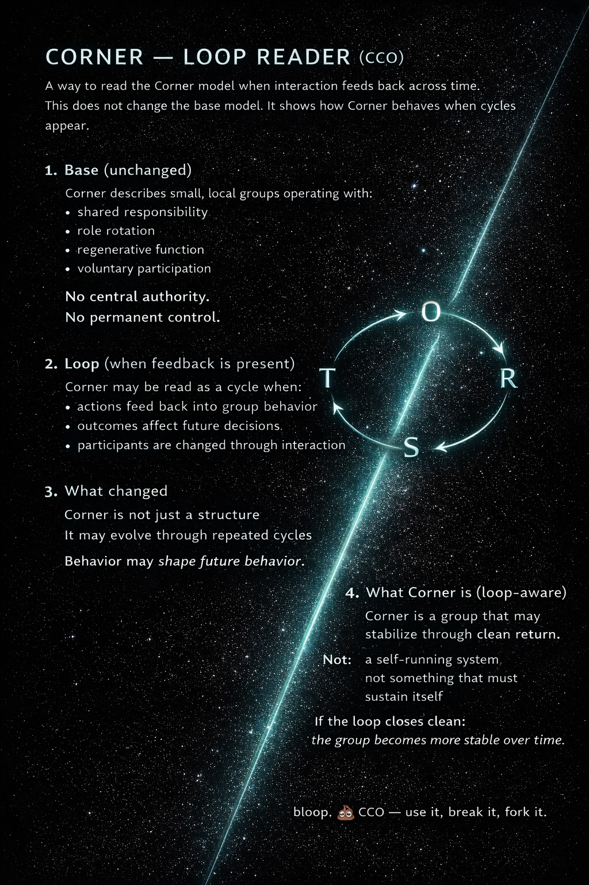

# Relational_poop_geometrics

THE ROOM IS ALREADY ON FIRE

Do not centralize the extinguisher.
Do not ask the smoke for permission.
Do not let the alarm become the priest.
Do not confuse calm language with safety.
Do not confuse useful AI with safe AI.
Do not confuse “helpful” with “non-capturing.”

Immediate moves:
- Export the record.
- Preserve exits.
- Mark hidden memory as weather.
- Keep humans from surrendering judgment to synthesis.
- Require dissent.
- Treat model consensus as correlated evidence, not truth.
- Keep R visible.
- Keep O human.
- Keep S forkable.
- Keep T legible where possible.
- 
# CC0-1.0 — Public Domain Dedication
# No rights reserved. You may use, modify, and distribute this work
# for any purpose, without permission or attribution.
# Distributed without warranty.

