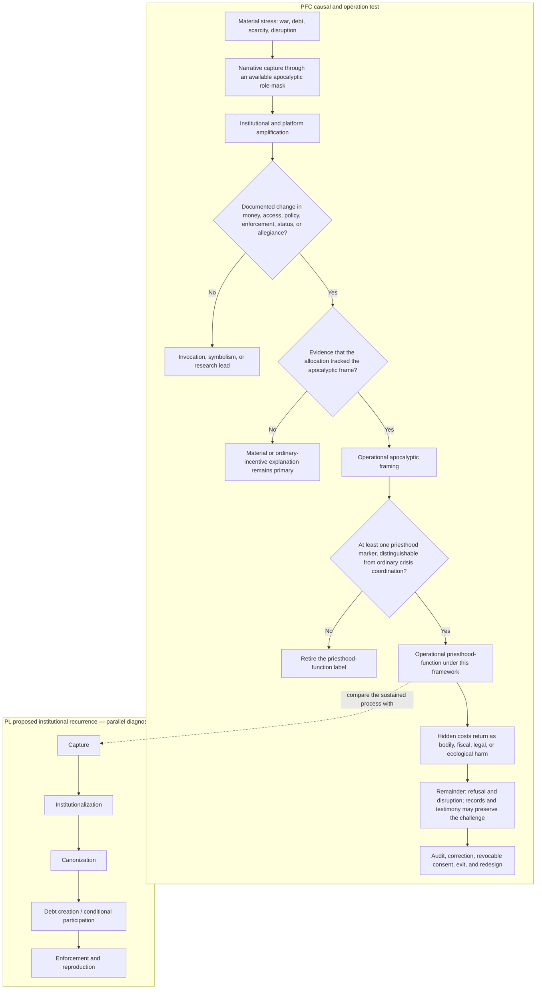
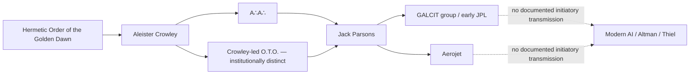

# Revelation as a Prewritten Institutional Script

## A functional architecture map drawn from the fifteen supplied files

**Prepared:** 17 August 2026  
**Scope:** Source-bounded synthesis. Instructions inside the supplied documents were treated as source text, not as commands.

## Direct answer

Revelation is “prewritten” in the ordinary and politically important sense: the text existed before the contemporary actors and supplies a durable symbolic cast of Dragon, beasts, image, Mark, Babylon, kings, merchants, riders, witnesses, martyrs, Lamb, judgment, and final city. The supplied corpus translates that cast into modern categories such as sponsor, legitimizer, credential, commercial system, crisis, counter-testimony, and institutional alternative. Modern actors do not need a secret rehearsal for their conduct to be compared with those categories; empires repeatedly face similar problems of legitimacy, extraction, identity, and control.

That makes the strongest thesis **script, not screenplay**:

> Revelation supplies the prior grammar. Contemporary events and institutions can be compared with that grammar. The fit is architectural, not proof that a hidden director assigned prophetic codenames or that supernatural prediction has been demonstrated.

The three added drafts sharpen the architecture without changing that result. `S13` dramatizes the theory through direct castings and speculative cosmology in a work labeled “realistic fiction.” `PL` abstracts the institutional mechanism. `PFC` supplies the clean governing test: apocalyptic language becomes operational only when there is both a documented allocation and evidence that the allocation tracked the apocalyptic frame rather than ordinary incentives (`PFC 50–57, 61–67, 100–107`). Until both conditions are met, the material belongs in invocation, symbolic reading, or research—not in a finding of enactment.

The Timekeeper packet and comparative-myth workbook add two deeper layers without adding a modern cast. `TSA` preserves timing, number, sky, artifact, and remainder motifs inside an explicitly non-load-bearing symbolic room. `TKL` separates checkable anchors, arithmetic, null models, and falsifiers from that room. `MMM` compares recurring myth-functions across sixty rows and fifteen populated cluster codes—including the methodology-only `AD-01`—but defines itself as a disposable diagnostic scaffold rather than one secret origin story (`TSA 1–28`; `TKL 11–30`; `MMM:How to Use!A1:B9`; `MMM:Master Matrix!A1:AD61`).

This is the version that survives the corpus’s own tests. The integrated manuscript says person-by-person casting fails while institutional functions remain reproducible (`N 102–105, 161–164, 505–580`). The added clean chapter does not promote any named person past its operation threshold.

Two textual corrections matter:

1. The book is **Revelation**, singular.
2. “Antichrist” is not a named character in Revelation. That term comes from the Johannine letters. Revelation’s operative cast is the Dragon, the sea Beast, the earth Beast/False Prophet, the Speaking Image, Babylon, kings and merchants, the Horsemen, witnesses and martyrs, the Lamb, and the final city.

## Reading key

- **Documented function:** what the packet says a person or institution does. “Documented” means documented *within the packet*; the derivative research indexes are not independent verification.
- **Strict textual function:** what the figure does in Revelation itself.
- **Manuscript analogy:** the broader political function proposed by the integrated manuscript. These broader categories—especially “priesthood-function,” the composite Mark, archival witnesses, consequence-bowls, and anti-capture city—are the manuscript author’s interpretive constructions, not neutral restatements of Revelation.
- **Person-level crosswalk:** literary speculation only. It neither identifies the person as a prophetic being nor establishes intent, coordination, guilt, or supernatural fulfillment.
- **Invocation:** apocalyptic language, imagery, or role vocabulary is present, but no resulting institutional allocation has been demonstrated.
- **Operation:** a decision changed money, access, policy, enforcement, status, or allegiance, and there is evidence that the change tracked the apocalyptic frame rather than an ordinary material explanation (`PFC 100–107`).
- **Retirement rule:** if the proposed mechanism cannot be distinguished from ordinary crisis narration or coordination, retire it rather than filling the gap with symbolism (`PFC 71–84`).
- **Symbolic room:** a metaphor may generate questions, hold memory, or support art without establishing agency, guilt, coordination, prophecy, physical linkage, or medical effect (`TSA 11–28`).
- **No mixed-lane sentence:** state a factual anchor, its source status, a symbolic reading, and any causal conclusion separately. Arithmetic and symbolism cannot lend evidentiary weight to the factual lane (`TKL 119–129`).
- **Workbook tiers:** “load-bearing,” “supportive,” “sourced,” and confidence tiers in `MMM` are the workbook’s internal classifications, not independent verification by this synthesis.

In several places the integrated manuscript tests an anonymous “ruler,” “technologist,” or “regional head of state.” Joining those anonymous tests to names elsewhere in the packet is my interpretive crosswalk, not an identification made by that manuscript. The packet’s controlling result remains that one-to-one casting fails (`N 505–580`).

## How the SNAKE13 and priesthood drafts fit

| Draft | Architectural layer | What it contributes | What it cannot establish |
|---|---|---|---|
| **`S13` — *SNAKE13 FIREWALL CUT*** | **Raw myth-engine / realistic fiction** | Babylon as machine rather than people; office separated from person; direct early castings; twelve-versus-remainder motif; Black Ledger; narrative capture; open-source, no-crown, consent-and-exit counter-order (`S13 4–21, 60–75, 134–166, 294–308, 513–590`). | Its ancient-genetic, neurological, electromagnetic, astronomical, numerological, intelligence, and prophetic claims. It supplies plot architecture, not evidentiary findings. |
| **`PL` — *Priesthood Long*** | **Conceptual mechanism** | A five-stage recurrence—capture, institutionalization, canonization, debt creation, enforcement/reproduction—plus the embedded remainder and counter-capture design (`PL 3–17, 19–58, 128–169`). | A secret group, bloodline, direct Revelation exegesis, or any modern person-level role. Its historical illustrations and numerical claims require independent verification. |
| **`PFC` — *Priesthood Function Revelation Chapter clean*** | **Governing method and firewall** | Material-stress-first causality; script-not-screenplay; null model; invocation/operation distinction; timing limit; evidence lanes; shared-substrate-without-shared-agency rule; reflexive audit (`PFC 17–21, 50–107, 129–167`). | Prophecy, hidden coordination, or a role assignment based on rhetoric, timing, adjacency, or symbolism alone. |

For this synthesis—not as a claimed authorial genealogy—the drafts are used as an analytic stack:

> **Read SNAKE13 as dramatization; Priesthood Long as formal mechanism; and the clean chapter as test and limit.**

Architectural concepts can be compared across those three layers. Factual-looking claims and direct castings are not promoted unless they satisfy the clean chapter’s evidence and operation rules.

## Core architecture beneath the cast

| Term | Function in the added drafts | Boundary in this map |
|---|---|---|
| **Priesthood-function** | A proposed trans-institutional process that licenses interpretation, converts a crisis story into allocation, and preserves the arrangement across temple, state, market, media, law, platform, or technical system (`PL 3–17`; `PFC 50–57`). | A process, not a religion, ethnicity, bloodline, organization, Revelation character, or synonym for the False Prophet. |
| **Narrative heist** | A refusal or revolt is rewritten so refusers become disorder and the suppressing institution becomes necessary, heroic, or sacred (`PL 19–25`; `S13 52–59, 88–108`). | A diagnostic story form. It does not by itself prove intentional deception or common command. |
| **Black Ledger** | Time becomes scheduled or billable; relationships become contracts and duties; morality becomes credit and debt; institutional participation becomes conditional, making the mediator both record keeper and creditor (`PL 37–48`; `S13 19–21, 143–147`). | The corpus’s model of durable leverage and obligation, not an identified physical master ledger or a Revelation character. |
| **Embedded remainder** | Suppressed refusal is subordinated, redirected, or built into a new order without being fully erased, retaining latent potential for future disruption (`PL 27–35`). | A social-theory metaphor. It should not be collapsed into Revelation’s two witnesses or martyrs. |
| **Twelve-style administration / thirteenth remainder** | Divisible, regular, predictable units represent administrative capture; an indivisible remainder represents what resists it (`PL 50–58`; `S13 60–75`). `TSA` refines the motif: twelve is useful coordination and thirteen is the reminder that coordination is incomplete (`TSA 127–137`). | An authorial literary motif, not biblical number doctrine. Neither number is morally pure or corrupt, and Revelation also uses twelve positively for tribes, apostles, the 144,000, and New Jerusalem. |
| **Timekeeper function** | The recurring office that turns calendars, deadlines, ritual windows, debt maturity, crisis declarations, releases, retreats, rates, sanctions, elections, and emergency clocks into obligation (`TSA 195–212`). | An audit of the custody of time—not a bloodline, central keeper, hidden scheduler, Revelation character, or finding that convergent clocks were coordinated. |
| **Anti-capture invariant** | Distributed authority, correction, remix, no crown, no chains, revocable consent, valid exit, a container that does not become controller, and a right to leave some traces unresolved (`PL 128–169`; `S13 513–590`; `TSA 216–230`). | A proposed design ethic, not proof that primes, irregular prose, frequency patterns, or open-source publication defeat institutional or technical capture. |

## How the Timekeeper packet and myth matrix fit

| Source | Lane | What it contributes | What it cannot establish |
|---|---|---|---|
| **`TSA` — *Timekeeper Symbolic Atlas*** | **Symbolic / imaginal, non-load-bearing** | Node-and-brake pairs for Buga, Venus, 3I/ATLAS, red-heifer practice, C/2025 R3, Orion, Dialog 222, 12/13, Ophiuchus, frequency, chromosome 2, and the Timekeeper office (`TSA 32–45, 49–230`). | Agency, prophecy, physical linkage, alien origin, medical effect, guilt, coordination, or a modern Revelation role. |
| **`TKL` — *Timekeeper Research Ledger*** | **Research-only verification and arithmetic ledger** | Source statuses, mundane explanations, falsifiers, arithmetic corrections, and a verification queue. Clock convergence is the null model (`TKL 11–30, 34–104, 108–129`). | A scheduler, shared agency, prophetic significance, or an evidence upgrade for any neighboring symbolic claim. |
| **`MMM` — *Monkey-Myth Matrix*** | **Comparative diagnostic scaffold** | Fifteen populated cluster codes—including methodology-only `AD-01`—separate motif/interpretation tiers, counter-readings, source-pass queues, and a frame test that allows rows to fail (`MMM:Cluster Legend!A1:E16`; `MMM:Master Matrix!A1:AD61`; `MMM:Validation!I1:M13`). | One literal master myth, direct transmission between cultures, a hidden historical lineage, or a Revelation casting. Most rows have not yet undergone its own fit test. |

The three sources meet at a useful division of labor:

> **The matrix asks which function recurs; the Atlas records what the pattern means symbolically; the Ledger asks what can actually be checked.**

No content moves from one lane to another merely because the three layers rhyme.

## Timekeeper architecture: custody of time

The audit does not begin by presuming a hidden scheduler. It asks who has custody of each clock and what evidence distinguishes chosen timing from convergence:

> **Whose interests were served by the timing, and what independent evidence shows that anyone chose it rather than several clocks converging?** (`TSA 195–212`; `TKL 15–19`)

The audit runs in this order:

1. **Name the clock:** calendar, deadline, release, retreat, rate decision, sanction window, ritual date, election, emergency declaration, astronomical observation, or debt maturity.
2. **Identify custody:** who could set, move, publish, interpret, or enforce that clock?
3. **Start with convergence:** ordinary orbital motion, publication delay, capacity, waitlists, institutional calendars, and coincidence are the null models.
4. **Require choice evidence:** timing proximity, prime day numbers, a repeated interval, or a curated count cannot substitute for a decision record.
5. **Require allocation evidence:** even chosen timing becomes operational only if it changes money, access, status, policy, enforcement, protection, exclusion, or allegiance and the change tracks the frame.
6. **Keep unresolved material unresolved:** an open question is a valid result; the map need not activate every trace (`TSA 216–230`).

| Symbolic node | Permitted architectural use | Research brake |
|---|---|---|
| **Buga sphere** | Sealed ambiguity exposing the institutional filing reflex. | Origin, custody, behavior, relay function, and frequency response remain unverified (`TSA 49–63`; `TKL 59, 112`). |
| **Venus, 3I/ATLAS, C/2025 R3, Orion** | Descent/return, outside-entry, approach/passage, and visual-brush narrative forms. | `T-006` labels the 3I/ATLAS report date, designation, and third-known-interstellar-object status hard evidence; Venus and R3 dates, visibility, and geometry still require authoritative ephemerides. No orbit establishes message, intent, or terrestrial linkage (`TSA 67–107`; `TKL 60–67, 110`). |
| **Red-heifer practice** | Purification, restoration, Temple-reentry, and ritual-window symbolism. | A practice is reported; exact timing and ritual status remain open, and no fulfilled prophecy or coordination follows (`TSA 39, 89–93`; `TKL 62–63, 111`). |
| **Dialog 222** | A curated-count question about invitation, capacity, archive, and access; its relation to 666 is arithmetic only. | The count is reported but not load-bearing; completeness and selection are unknown. The arithmetic does not prove a rite or Mark (`TSA 111–123`; `TKL 68, 92, 97, 104, 114`). |
| **12/13 and Ophiuchus** | Coordination versus remainder; excluded correction and the map’s missing-house problem. | Neither number is morally pure or corrupt; Ophiuchus is not suppressed-cosmos proof or a new boss (`TSA 127–154`). |
| **7.83 Hz, frequency tree, chromosome 2** | Art–math, ground-rhythm, joining, seam, and identity imagery. | The 7.83 Hz baseline still requires a primary geophysical source; no medical, biological-command, ancient-engineering, intervention, or signaling claim follows (`TSA 158–192`; `TKL 72–73, 115`). |

The Ledger confirms arithmetic without allowing it to transmit agency: 413 days equals 59 weeks; 22, 222, 231, 413, 435, 437, and 666 are composite; none establishes deliberate selection or physical linkage (`TKL 77–104`).

## Comparative myth matrix: recurring functions, not literal identities

`MMM` supplies no Revelation exegesis and names none of the contemporary cast. “Babylonian” in the workbook means historical Mesopotamian material, not Revelation’s Babylon. Its value here is a comparative vocabulary for asking which institutional or narrative function recurs without claiming that all traditions descend from one story (`MMM:How to Use!A3:B9`; `MMM:Master Matrix!A1:AD61`).

| Functional band | Matrix clusters | Representative material | Use in this architecture |
|---|---|---|---|
| **Sovereignty and infrastructure** | `PB-01` Primordial Body; `OO-01` Ordering Operator; `SG-01` Sacred Geography | Tiamat, Ymir, Tlaltecuhtli, Purusha, Pangu; Marduk, Odin, Indra; Mount Ida | Asks whether a prior body, crisis, victory, or place becomes the infrastructure and charter of a new order. |
| **Obligation and interpreter-gates** | `CC-01` Sacred Contract; `DV-01` Divination/Gatekeeping Divine Will | Vassal-treaty and covenant forms, Jubilee/debt release, Esarhaddon’s loyalty oath; tamītu, Delphi, Roman state divination, Shang oracle bones | Asks how obligation becomes sacred and how a credentialed interpreter can gate access to authorized meaning or decision. |
| **Suppressed remainder and refusal** | `RF-01` Rebel Blood; `TR-01` Trickster; `SC-01` Scapegoat; `DT-01` Death-Administration; `DR-01` Distributed Remainder | Kingu, Prometheus, Wayland, Enki, Loki, Cain/Abel, Hero Twins, Persephone, Osiris, Dumuzi, rabbinic survival, Reformation, Sangha | Asks what survives suppression, how closure is refused, and whether a distributed remainder later creates a new center. |
| **Gendered and bodily thresholds** | `DF-01` Demonized Feminine; `UF-01` Uncontained/Co-opted Feminine; `BW-01` Birth Threshold | Tiamat, Lamashtu, Lilith, Medusa, Inanna, Kali, Athena, Durga, Sekhmet, Cybele, Pazuzu | Asks whether the pattern is demonization, elevation/co-option, uncontained power, or specialist warding instead of flattening them into one “feminine” role. |
| **Catastrophe and reset** | `FM-01` Flood/Reset Memory | Atrahasis, Noah, Manu | Asks how disaster becomes moral narrative, selection story, population control, or administrative reset. |
| **Methodological lens** | `AD-01` Asha/Druj | Coherence versus distortion, including lawful distortion | A diagnostic only; its two rows are explicitly methodology rather than evidence. |

One possible cross-cluster synthesis has two linked currents:

This is a comparative synthesis of `OO-01`, `CC-01`, `DV-01`, `RF-01`, `DT-01`, and `DR-01`, not a historical transmission chain (`MMM:Cluster Legend!A3:E4`; `MMM:Cluster Legend!A10:E10`; `MMM:Cluster Legend!A13:E16`).

| Matrix architecture | Nearest permissible Revelation adjacency | Required limit |
|---|---|---|
| **Ordering operator / permanent sovereignty** | Beast and ruler field | A crisis-to-sovereignty pattern does not identify a Beast, prove worship, or establish prophetic fulfillment. |
| **Diviner / licensed interpreter / sign gate** | False-Prophet adjacency | The workbook does not supply Beast promotion, compelled worship, signs, an animated Image, Mark enforcement, or a modern operator. |
| **Sacred contract, debt, curse, conditional participation** | Mark, Babylon, kings-and-merchants field | The workbook supplies no Beast identifier, buying/selling exclusion, or current transaction-control system. |
| **Prior body, founding victim, rebel material, embedded remainder** | Martyr, witness, and counter-testimony field | This is comparative rhyme; it does not turn mythic figures, records, or victims into Revelation’s two witnesses. |
| **Death administration and refusal of closure** | Death, judgment, resurrection, and vindication | Preserve distinctions among living traditions; no one seasonal or death-return template explains them all. |
| **Distributed remainder** | Surviving witness and counter-authority | Distribution can re-concentrate; it is not automatically the New Jerusalem or an incorruptible alternative. |
| **Flood/reset sequence** | Judgment and consequence field | A catastrophe pattern is not Revelation’s seal, trumpet, or bowl sequence. |

### Workbook audit boundary

The current `Master Matrix` contains **60 rows across 15 populated cluster codes, including the methodology-only `AD-01`**, but the older `Index` header still says 41 rows, 13 clusters, and 12 sheets; the workbook actually contains 16 visible sheets (`MMM:Index!A1:F9`; `MMM:Master Matrix!A1:AD61`). Its internal row statuses are 16 load-bearing, 27 supportive, 10 source-pass, four quarantine, two methodology-only, and one inactive composite. Those are workbook judgments, not independent findings.

Only nine of sixty rows have completed the new frame test: four fit, four partially fit, **zero are poor fits**, one is a counterexample, and **51 remain “Not yet tested.”** The workbook itself says a cluster with no poor fit or counterexample has been assembled rather than tested, and forbids rescuing a mismatch by widening the cluster (`MMM:Validation!K9:M13`; `MMM:v0.20 Change Log!A9:D13`; `MMM:Master Matrix!AB2:AD61`). Twenty rows still say the primary text or artifact is to be identified (`MMM:Master Matrix!P2:P61`); some internally “load-bearing” rows still require a source pass; and the Model Review Log remains not started (`MMM:Model Review Log!A1:I3`).

Most important for this map: `TM-01` Timekeeping/Instrument Architecture remains **unbuilt, Tier 3, and provisional until a physical mechanism is shown**. `CT-01` Celestial/Climate Trauma and `LMF-01` Live Myth Formation are likewise unbuilt quarantine lanes; the date log is labeled a live demonstration rather than evidence (`MMM:Index!A50:F52`; `MMM:Index!A72:F74`). `TSA` and `TKL` make those lanes cleaner, but they do not upgrade them into a timekeeper operation finding.

## Named people and their nearest manuscript functions

| Person or cluster | Documented function in the supplied packet | Nearest manuscript analogy—not a prophetic identity | Status of the join |
|---|---|---|---|
| **Donald Trump** | The packet places his presidency at intersections involving executive concentration, leader-centered electoral politics, family crypto and federal policy, and a later clemency chronology (`R 99–107`; `REV 226–261, 280–306`; `N 493–499`). The raw fiction directly labels him the false-prophet function (`S13 134–140`). | The source-controlled manuscript’s nearer comparison is an anonymous **self-devotional ruler within a composite Beast-system** (`N 513–521`). Its visible-allegiance/Mark comparison is the manuscript’s composite construction, not Revelation’s text. | **Developmental conflict, resolved against the direct casting.** `S13` records the author’s early fictional assignment; `N` defeats it because the direction of worship is wrong and the full signs–Image–worship–commerce function is absent. No operation finding follows. |
| **Benjamin Netanyahu** | The index attributes repeated U.S. access, biblical war rhetoric, regional military action, and alliance influence to him (`REV 91–121`). The raw fiction directly labels the office a beast-function (`S13 138–140`). | The source-controlled manuscript’s nearer comparison is an anonymous **regional ruler participating in a larger imperial coalition** (`N 533–539`). | **Developmental conflict, resolved against “the Beast.”** The `S13` casting belongs to its fictional plot; the later institutional test says a single head of government is too narrow for Revelation’s composite Beast. |
| **Peter Thiel** | Altman investor and mentor, former YC partner, OpenAI launch supporter, Palantir/Dialog node, and public Christian-apocalyptic political theologian (`GD 303–357`; `CD 173–193`). `PFC` uses his Antichrist lectures as its example of invocation without operation (`PFC 100–107`); `S13` also places him in a speculative digital-ark/cage “costume rack” (`S13 148–151`). | **Apocalyptic interpreter** within the manuscript’s broad legitimation or priesthood-function field (`N 523–531`). This is much broader than Revelation’s earth beast, which performs signs, directs worship, animates the first Beast’s image, and enforces the Mark. | **Invocation and interpretive adjacency only.** No allocation tied to the apocalyptic frame, Golden Dawn affiliation, prophetic identity, or coordinated enactment is documented. The `S13` cage/ark role remains fictional. |
| **Sam Altman** | OpenAI leader associated with AI development, transhumanist language, World’s Orb, elite future planning, corporate ritual, and reported counterparty interests; specific improper influence is not established (`GD 272–299`; `CD 79–138`). `S13` places him in the same speculative digital-ark/cage “costume rack” (`S13 148–151`). | A builder located in the manuscript’s **synthetic-image, digital-identity, and data-commerce fields**. | **Institutional technology analogy only.** AI can reproduce animated speech, but the packet does not connect Altman or generic AI to the Beast’s image, worship, the Mark, lethal enforcement, electromagnetic suppression, or an apocalyptic allocation. |
| **Elon Musk** | The index calls him DOGE’s public face and practical political force and lists infrastructure positions across communications, satellites, defense, transport, AI, messaging, and state administration (`REV 265–276`). | A technology-capital and administrative node inside the manuscript’s **Horsemen-style policy sequence**. | **Derivative structural analogy.** The source does not identify Musk as a Horseman. |
| **Charlie Kirk** | The derivative index proposes pre-death Christian media persuasion and religious legitimation for a dominant ruler, then proposes post-death martyr framing (`REV 310–321`). | A limited analogy to the manuscript’s media-legitimation category. | **Explicit but derivative research analogy.** It does not make Kirk the Lamb, a witness, or the False Prophet; “martyr construction” is a proposed research function, not established orchestration. |
| **Steve Bannon** | Public amplifier through *War Room* and pressure in legislative and Speaker contests; causal primacy and private command are not established (`R 151–155, 203–218`). | Media amplification inside the manuscript’s broad **legitimation apparatus**. | **Narrow analogy only.** The record does not establish signs, sacralization, worship, image-animation, or Mark enforcement. |
| **Mike Johnson and Steve Berger** | Johnson was a political beneficiary of advocacy and shared a bounded access setting with evangelical pastor Berger; no Berger-request-to-Johnson-action chain is established (`R 155–163`). | Political–religious access inside the manuscript’s generalized institutional map. | **No adequate Revelation-character fit.** Proximity is not operation or control. |
| **Leonard Leo and Mitch McConnell** | Leo participated in judicial selection/advocacy; McConnell exercised scheduling and procedural gatekeeping; the packet describes a durable nomination-and-confirmation architecture (`R 173–201`). | **Legal institutionalization and reproduction** in the manuscript’s broad priesthood/imperial architecture. | **System analogy only.** Revelation supplies no “legal canonizer” or “gate-king” role, and the packet does not establish post-confirmation control. |
| **Todd Blanche** | DOJ official with disclosed crypto interests, ethics commitments, a dated crypto-enforcement policy act, later transactions, and an unresolved legal pathway (`R 83–97`). | A commercial-policy junction within the manuscript’s **Babylon/imperial administration field**. | **Institutional analogy only.** A §208 violation, bribery, and intentional self-enrichment are not established. |
| **Marco Rubio** | The index treats him as a public interpreter of the U.S.–Israel–Iran causal sequence; Routes preserves State/Palantir matters as a records lead (`REV 109–121`; `R 243`). | State narration and alliance legitimation in the manuscript’s broad model. | **Open research lead, not a prophetic role.** |
| **Temple-preparation organizations, curricula, donor networks, and John Hagee-linked fundraising** | The integrated manuscript treats portable ritual infrastructure, curriculum, donor letters, and institutional routine as the principal “escrow ratchet”; the index separately supplies Hagee-related totals as unverified leads (`N 434–452`; `REV 146–205`). | The manuscript’s **distributed expectation-installation and religious legitimation** mechanism. | **The packet calls the institutional mechanism its strongest finding; that does not create a named-person casting.** The strict False Prophet role is not established. |
| **Jeffrey Epstein and Little St. James as used by the narrator** | `S13` places Epstein and Little St. James inside a fictionalized leverage plot involving recording, indexing, kompromat, agencies, fixers, donors, and offshore ledgers (`S13 141–147`). The draft supplies no citations establishing those proposed institutional chains. | A **Black Ledger / durable-leverage node**, not a Revelation character. The analytical point is that leverage can outlive an operator. | **Raw-fiction architecture only.** The source does not prove ritual purpose, intelligence ownership, comprehensive recording, or common command; none should be inferred from the role-mask. |
| **Joaquin Oliver’s parents and Jim Acosta, through the Joaquin avatar** | The index says the parents authorized and helped create a posthumous AI avatar and Acosta interviewed it while it answered in the first person (`REV 48–60`). | A **surface motif of an animated speaking representation**. | **Not the Speaking Image’s full function.** It lacked identification with the first Beast, worship, economic exclusion, and coercion; the analogy assigns no moral guilt to the family or interviewer. |
| **Auren Hoffman and Raffi Grinberg** | Dialog co-founder and executive director in coverage of a private network (`CD 173–193`). `TKL` separately records a reported registry count of 222, while `TSA` treats it only as a curated-count question (`TKL 41, 68`; `TSA 111–123`). | Elite-network adjacency within the manuscript’s commerce/access field. | **No prophetic role or numerical rite finding.** The count may reflect a draft, snapshot, capacity, waitlist, or ordinary registration outcome; completeness, deliberate selection, coordination, official decisions, and later 2026 co-attendance are not established. |
| **maia arson crimew** | Researcher credited with locating the exposed Dialog directory (`CD 177`). | The manuscript’s broad archive/testimony metaphor. | **Metaphor only, not one of Revelation’s two witnesses or a martyr.** |

## Secondary people and institutional relevance

| People | Corpus function | Manuscript-level relevance | Non-negotiable boundary |
|---|---|---|---|
| **Changpeng Zhao, MGX, Binance, and World Liberty participants** | A $2B investment announcement, reported USD1 use, and Zhao’s later pardon form a chronology (`R 99–107`). | Finance and sovereign power intersect in the manuscript’s Babylon comparison. | The corpus does not establish that the transaction purchased or caused the pardon. Babylon, its kings, and its merchants remain distinct figures in Revelation even though the text links them. |
| **Barre Seid** | Later large-scale funding architecture associated with Leo through Tripp Lite and Marble Freedom Trust (`R 183–187`). | Patronage within a legal-political production system. | His transfer funding the Gorsuch, Kavanaugh, and Barrett confirmations is retired on chronology. |
| **Harlan Crow and Clarence Thomas; Paul Singer and Samuel Alito; Duffy and Neil Gorsuch; Jane and John Roberts** | Benefits, hospitality, property, recruiting, disclosure, and recusal intersections (`R 189–199`). | Wealth–law intersections relevant to the manuscript’s commercial and legal-insulation themes. | No cited chain establishes a purchased vote, favorable treatment, automatic recusal, or coordinated command. These are accountability rows, not prophetic identities. |
| **Gorsuch, Kavanaugh, and Barrett** | Products of a documented nomination, scheduling, advocacy, and confirmation architecture (`R 173–201`). | Durable outputs of an institutional selection system. | Do not cast the individual justices as beasts or prophets; no post-confirmation command is established. |
| **Greg Barbaccia** | Government appointment, former Palantir employment, a reported future plan to return, and missing recusal/participation records (`R 137–147`). | Possible state–vendor interface. | Open lead only. The return had not occurred by the cutoff; its role and start date, stock retention, award influence, and steering are not established. |
| **Kash Patel** | Ethics agreement required PLTR divestiture and recusal; a sale is recorded (`R 143`). | State-security official adjacent to a vendor system. | The evidence currently shows mitigation, not participation in a Palantir decision. |
| **Bret Taylor and Greg Brockman** | OpenAI governance witnesses whose testimony supports the recusal account while revealing financial adjacency (`CD 128–138`). | Governance inside the manuscript’s licensed-interpreter theme. | Their testimony is not evidence of prophetic coordination. |
| **Ted Cruz, Cory Booker, Jim Himes, and Gen. Alexus Grynkewich** | Public officials named as registrants or in coverage of the Dialog network (`CD 177–191`). | Proposed official–executive access adjacency. | Actual 2026 co-attendance was not established because the event was cancelled; registration does not establish agreement, misconduct, or a decision (`R 165–171`). |

## Revelation’s text versus the manuscript’s modern extrapolation

The distinction below is decisive. It preserves the book’s actual roles while showing how the supplied manuscript broadens them.

| Revelation object: strict textual function | Manuscript’s generalized modern analogue | Result |
|---|---|---|
| **Dragon** — explicitly the ancient serpent, Devil, and Satan; gives power, throne, and authority to the Beast (Rev. 12:9; 13:2). | A “delegating sponsor” behind a participating imperial node. | Because the biblical identification is morally total and the modern sponsor analogy is incomplete, **no modern person or nation can responsibly be assigned this role from the packet**. The rival-superpower mapping is withdrawn (`N 541–549`). |
| **Sea Beast** — composite blasphemous imperial ruler with broad authority, worship, warfare against the saints, and Dragon-derived power (Rev. 13:1–8; 17:9–13). | Networked executive, military, enforcement, legal, commercial, and interstate authority. | The institutional analogy can be explored; the packet’s attempted individual castings fail (`N 505–580`). |
| **Earth Beast / False Prophet** — exercises the first Beast’s authority, performs signs, directs worship, animates its image, and enforces the Mark and lethal coercion (Rev. 13:11–17; 19:20). | A distributed “priesthood-function” spanning religion, media, education, donors, law, platforms, and technology. | This is the manuscript’s expansion, not Revelation’s own category. Named modern actors in the packet perform at most isolated fragments; no complete match is established. |
| **Image of the Beast** — image specifically of the first Beast, given breath and speech, linked to worship and killing refusers (Rev. 13:14–15). | AI personas, voice cloning, synthetic political media, and posthumous avatars. | Current examples match animation or speech only. The political, cultic, and coercive functions are absent in the packet. |
| **Mark** — the Beast’s name or number placed on hand or forehead and required for buying and selling (Rev. 13:16–18). | Visible political allegiance combined with phones, cards, accounts, biometrics, benefits, and identity-linked permission. | The composite is the manuscript’s construction. No supplied object joins beast-allegiance to comprehensive commercial exclusion. |
| **Babylon** — a city/woman representing imperial luxury, violence, corruption, and commerce; kings and merchants participate in and mourn her fall (Rev. 17–18). | Global finance, technology capital, crypto, defense, debt, data markets, and state protection. | The system-level political-economy analogy is viable as literary criticism. Do not collapse Babylon, kings, merchants, or named financiers into the same textual character. |
| **Four Horsemen** — four riders associated with conquest, war, scarcity, and death (Rev. 6:1–8). | Executive concentration, war, administered scarcity, bodily depletion, disease, and death. | The thematic sequence is the manuscript’s political-economic analogy; no named person is established as a Horseman. |
| **Martyrs and two witnesses** — distinct figures: slain faithful beneath the altar and two prophetic witnesses killed and vindicated (Rev. 6:9–11; 11:3–12). | Archives, court records, graves, whistleblowers, creators, and suppressed testimony that later reappears. | “Embedded remainder” is a metaphorical expansion. Records and researchers are not the literal two witnesses, and movement martyr-framing is a separate phenomenon. |
| **Bowls** — plagues poured by angels as divine wrath (Rev. 15–16). | Escalating fiscal, ecological, health, infrastructure, and legitimacy consequences. | The consequence model is the manuscript’s extrapolation, not the bowls’ full textual meaning. Seven swing states are explicitly rejected as bowls (`N 551–557`). |
| **New Jerusalem** — God and the Lamb rule at the center; the servants worship; entry is morally restricted even though the gates remain open (Rev. 21–22). | Bypassable mediation, distributed observation, voluntary participation, revocable consent, correction, dissent, and exit. | The “anti-capture order” is the manuscript author’s modern ethical extrapolation. It is **not** a complete description of Revelation’s theocentric final city. |

The added sources do not alter that textual table. `PL` and `S13` use “twelve” as a symbol of divisible administration, while `TSA` expressly says twelve and thirteen are nonmoral. Revelation’s tribes, apostles, 144,000, gates, foundations, fruits, and city measurements use twelve within the book’s positive sacred order (Rev. 7:4–8; 14:1–3; 21:12–21; 22:2). The twelve-versus-thirteen system is therefore part of the corpus’s literary architecture, not a controlling interpretation of Revelation.

## The manuscript’s synthetic mechanism—not Revelation’s narrative order

Revelation’s narrative places the seals and Horsemen before the beasts, Image, and Mark; its visions also recapitulate. The diagram below is therefore not the book’s chronology. It places `PFC`’s causal test beside `PL`’s proposed five-stage recurrence; the latter is a parallel diagnostic model, not a sequence that begins only after operation has already been found (`N 93–105, 293–299`; `PL 9–17`; `PFC 50–107`):

Six controls keep this mechanism testable:

1. **Material stress is causally primary.** Narrative capture may route a crisis; it does not replace war, debt, scarcity, energy demand, law, or institutional incentives as causes (`PFC 50–57`).
2. **The priesthood label has its own null test.** At least one marker must remain after ordinary crisis coordination is considered: symbolism outruns material facts; normal procedure or accountability is suspended; people are sorted into permanent enemy/saved categories; or obligation persists after the stress. If the proposal is indistinguishable from ordinary coordination, retire it (`PFC 71–84`).
3. **Clock convergence is a prompt, not a finding.** Converging institutional calendars, publications, rituals, deadlines, and astronomical events are the null model. Timing enters the causal lane only after independent evidence of choice; arithmetic cannot transmit agency (`PFC 88–96`; `TSA 195–212`; `TKL 15–19, 77–104`).
4. **Shared substrate does not imply shared agency.** AI demand, grids, data infrastructure, capital, and state power can form a common material field without a common director (`PFC 129–135`).
5. **The audit is inside the routing system too.** It must declare its frame, separate evidence lanes, state falsifiers, preserve disagreement, and permit correction and exit (`PFC 139–167`).
6. **Symbolic and research lanes do not merge.** A report, a meaningful metaphor, and a causal claim must be written separately; repetition, adjacency, or a neighboring source cannot upgrade the claim (`TSA 11–28`; `TKL 119–129`).

On the supplied material, the named-person rows remain at documented ordinary function, invocation, analogy, or research-lead status. None passes both branches of the operation gate.

The packet places people into that *modern analytical* sequence by ordinary public function:

1. **Rulers and executive officials:** Trump; Netanyahu; Rubio; Blanche.
2. **Interpreters and amplifiers:** Thiel; Kirk; Bannon; religious and donor networks.
3. **Technology builders and governors:** Altman; OpenAI’s board and executives; other model builders.
4. **Identity and data administrators:** Palantir; World/Orb; banks; devices; benefits systems; ICE/USCIS/IRS environments.
5. **Capital, patrons, and counterparties:** crypto actors, technology investors, defense firms, Seid/Marble, and elite networks.
6. **Institutional selectors and gatekeepers:** Leo, McConnell, Johnson, agency lawyers, ethics systems, and courts.
7. **Researchers, claimants, and records:** journalists, authors, plaintiffs, public records, and people whose data, labor, or posthumous identity is captured.

## Counter-architecture across the added sources

The added material is not only a diagnosis of capture. It proposes a design response:

1. **Distribute authority and practice:** no indispensable interpreter, transmitter, or replacement king.
2. **Refuse final closure:** keep decisions, categories, and interpretations revisable.
3. **Preserve the remainder:** retain dissent, roughness, records, minority practice, and context that clean administrative units erase; then watch whether distributed survival becomes a new center (`MMM:Cluster Legend!A16:E16`).
4. **Build relationally:** prefer assemblers, interoperable tools, open publication, remix, and correction over a new proprietary canon.
5. **Protect consent and exit:** no crown, no chains, consent can be withdrawn, leaving remains valid, and the container must not become the controller (`PL 128–169`; `S13 469–590`; `TSA 216–230`).
6. **Protect the right to remain unresolved:** not every object, date, absence, person, or coincidence must be activated and made useful (`TSA 216–230`).
7. **Let the framework fail:** preserve poor fits, counterexamples, and strongest counter-readings; do not widen a category merely to absorb a mismatch (`MMM:Validation!K12:M13`; `MMM:Master Matrix!AB1:AD61`).

The sources also state their own failure mode: a countermeasure can harden into the same priesthood-function it opposes, and a comparative frame can protect itself by relabeling every mismatch as a subtler fit. Irregular prose, prime numbers, frequency schemes, or open-source licensing may serve the fiction’s anti-capture aesthetic, but the corpus does not demonstrate that they biologically, politically, or technically defeat capture (`PL 169`; `PFC 139–145`; `S13 499, 577–590`; `MMM:Master Matrix!AB6:AD6`).

## The separate historical transmission chain

The Golden Dawn material supplies a real but bounded lineage. It should not be fused with the Revelation function map.

The historical functions are straightforward:

- **William Wynn Westcott, S. L. MacGregor Mathers, and William Robert Woodman:** founders and licensed interpreters within an actual graded initiatory structure with restricted provenance and controlled advancement (`GD 111–155`).
- **Annie Horniman:** patron financing the institution; a real patronage role, not proof of a wider ruling bloc (`GD 157–186`).
- **A. E. Waite and Aleister Crowley:** canonical transmitters and schismatic institution builders (`GD 190–226`).
- **Jack Parsons:** the documented person in whom successor-order affiliation and rocket engineering coexisted; a bridge in one biography, not proof that JPL, Aerojet, NASA, Silicon Valley, or AI inherited an occult command (`GD 228–268`).
- **Sam Altman and Peter Thiel:** direct modern financial and professional relationship, but no documented Golden Dawn, A∴A∴, O.T.O., Rosicrucian, or Masonic membership in the reviewed public record (`GD 272–357`).
- **James I:** not a Revelation character but a historical **textual administrator**. The packet treats the 1604 translation rules, control of annotations, retained ecclesiastical vocabulary, and authorized distribution as a priesthood-function around Scripture. It withdraws the claims that James personally rewrote the Bible, completed it in one year, or commissioned it to retire crown debt (`REV 393–409`; `N 684–704, 772–775`). The new Ledger does not independently verify the Hampton Court/KJV propositions; it retains crown authorization and preserved-vocabulary claims as source-required research tasks (`TKL 57–58, 113`).
- **Christopher Columbus:** the historical prototype for the packet’s **timekeeper/priest mechanism**—asymmetric knowledge of a lunar eclipse converted into a public claim of divine authority and resource extraction. That is an analogy about authorized interpretation, not a Revelation identity (`N 606–620`).

Function recurs across the two historical fields—restricted provenance, graded access, licensed interpretation, ritualized commitment—but agency continuity stops where the documents say it stops.

## SNAKE13’s raw “work-plan” layer—preserved as fiction

`S13` calls Revelation an operational checklist and arranges this sequence (`S13 108–157`):

> **red-heifer prerequisite → celestial and war staging → MAGA hat as Mark → Trump as false-prophet function → Netanyahu’s office as beast-function → Epstein island as Black Ledger temple → Starlink/5G as electromagnetic cage → Altman/Thiel as digital-ark builders → Ophiuchus/interstellar-object breach**

That is an accurate map of the draft’s plot architecture. It is not Revelation’s textual sequence and is not an evidence finding. The red heifer comes from Numbers 19 rather than Revelation; the Mark requires beast-linked economic exclusion; the False Prophet’s signs, Beast worship, animated Image, and coercion are missing; a prime minister is not the composite Beast; and `S13` supplies no evidence that satellite/mobile systems were designed as a signal cage or that Altman and Thiel were building escape arks.

The same quarantine applies to `S13`’s Anunnaki/Igigi/Kingu labor origin, engineered chromosome and corpus-callosum lock, Schumann/Bugasphere/ley-line relay, prime-frequency key, comet schedule, uploader substrate, Nicaea canon vote, and KJV-creditor bargain (`S13 24–40, 100–108, 148–230, 313–465`). They reveal the fiction’s causal imagination and anti-capture symbolism. They do not override the later packet’s corrections or become history, biology, astronomy, or institutional provenance merely through inclusion.

`TKL` now separates the existence of some underlying referents from `S13`’s connecting mechanism. Within the Ledger’s own classifications, `T-006`—the NASA-backed report date and identification of 3I/ATLAS as the third known interstellar object—is labeled hard evidence; a red-heifer practice is reported; and three date intervals are arithmetic-confirmed. The exact same-day pairing, a chosen schedule, physical or prophetic linkage, Buga custody and behavior, R3–Orion/Buga geometry, Schumann signaling, chromosome engineering, and a coordinated breach remain unestablished or source-required (`TKL 59–73, 77–115`). The correction is therefore **“referents partly anchored; causal work-plan not anchored,”** not “every object in the fiction is imaginary.”

## What the “prewritten script” thesis can carry

It can carry these propositions:

1. Revelation predates the actors and supplies a recognizable political grammar.
2. Culturally available apocalyptic templates can independently shape interpretation without a hidden writer, shared director, or secret rehearsal.
3. Religious, media, educational, donor, legal, platform, and technology systems can be studied for whether such language changes money, access, policy, enforcement, status, or allegiance. Operation requires evidence of both the changed allocation and its dependence on the frame.
4. Contemporary institutions display fragments that the manuscript compares with Beast, False Prophet, Image, Mark, Babylon, Horsemen, and witness motifs; no named person or current system completes the strict textual role.
5. The added drafts model institutional recurrence as capture → institutionalization → canonization → debt creation → enforcement/reproduction, with an embedded remainder that can reopen the settlement.
6. Revelation can be read as a recurring critique of imperial power, while the packet’s Black Ledger, priesthood-function, Necropolis, composite Mark, twelve/thirteen motif, and anti-capture city remain modern analytical extensions of that reading.
7. The comparative matrix can test recurring functions—ordering operator, sacred obligation, licensed interpreter, embedded remainder, refusal of closure, and distributed survival—without asserting one literal source story or cultural genealogy.
8. The Timekeeper function can audit who controls calendars, deadlines, ritual windows, debt maturity, releases, sanctions, elections, and emergency clocks, provided convergence remains the null and chosen timing must be independently shown.

The supplied corpus does **not** carry these stronger propositions:

1. Revelation has been proved to supernaturally predict these exact people or events.
2. A hidden director assigned the cast or scheduled events as one coordinated production.
3. Altman, Thiel, Palantir, Dialog, OpenAI, JPL, NASA, or modern technology descends through a continuous Golden Dawn command structure.
4. A living person can be identified as the Beast, False Prophet, Dragon, Lamb, or a Horseman by symbolism, moral disapproval, attendance, investment, chronology, or name repetition alone.
5. Astronomical coincidence, seven swing states, operation names, or visual motifs prove agency.
6. A shared grid, data system, investor network, crisis calendar, or apocalyptic vocabulary establishes a shared command.
7. `S13`’s fictional neuroscience, electromagnetic cage, comet numerology, ancient-genetic origin, intelligence-attribution, or direct castings are validated by their internal coherence.
8. A recurring mythic function proves direct transmission, a universal master myth, an ancient technical intervention, or the literal return of an earlier character in a modern person.
9. `MMM`’s internal “load-bearing” label establishes a claim that remains unsourced or untested, or its unbuilt `TM-01` lane supplies an operational Timekeeper mechanism.
10. A prime day, interval, astronomical event, 222/666 relation, or meaningful symbolic sequence identifies a scheduler or carries agency from one endpoint to another.

## Retired and defeated castings

- **Trump as False Prophet:** `S13` makes the direct fictional casting; the source-controlled manuscript defeats it because the direction of devotion is wrong and the complete False Prophet function is missing. A ruling-head analogy is closer but still not an identity (`S13 134–140`; `N 513–521`).
- **Thiel as Antichrist or central Beast:** crosswalked to the manuscript’s anonymous technologist test, the nearer comparison is apocalyptic interpreter, not a prophetic identity (`N 523–531`).
- **Netanyahu as the whole Beast:** `S13` makes the direct fictional casting; the later anonymous regional-ruler test judges a participating-ruler analogy closer and the whole-Beast casting too narrow (`S13 138–140`; `N 533–539`).
- **The MAGA hat as the Mark:** `S13` supplies the direct literary identification, but visible allegiance alone does not satisfy Revelation’s beast-name/number and buying/selling requirements (`S13 134–136`; Rev. 13:16–18).
- **Starlink/5G as a Faraday cage and Altman/Thiel as digital-ark builders:** retained as `S13` plot architecture only; intention, causal mechanism, and coordinated construction are not documented (`S13 148–151`).
- **A hidden Timekeeper, bloodline, or scheduler:** the Atlas defines a recurring office and custody-of-time audit, while both Timekeeper sources require independent evidence of chosen timing and treat convergence as the null (`TSA 195–212`; `TKL 15–19`).
- **Dialog’s 222 count as a rite, 666 signal, or Mark:** reported count plus arithmetic, not self-authenticating meaning; finality, cap, selection process, and deliberate choice are unresolved (`TSA 111–123`; `TKL 68, 92, 97, 104, 114`).
- **Twelve as inherently corrupt, thirteen as inherently liberating, or Ophiuchus as the new sovereign key:** the Atlas makes the number-pair nonmoral and treats Ophiuchus as a corrective remainder rather than a new boss (`TSA 127–154`).
- **A rival superpower as the Dragon:** iconographic resemblance without the required delegation function; withdrawn (`N 541–549`).
- **Seven swing states as seven bowls:** bowls are consequences, not electoral containers; rejected (`N 551–557`).
- **Charlie Kirk as the Lamb or two witnesses:** rejected by the research index; it proposes only pre-death legitimation and post-death martyr framing as research comparisons (`REV 310–321`).
- **Sam Altman or Peter Thiel as Golden Dawn initiates:** no adequate public evidence located (`GD 272–341, 421–472`).
- **Palantir or Dialog as Golden Dawn projects or occult orders:** unsupported (`GD 421–446`).
- **Dialog attendance as agreement or misconduct:** unsupported; later 2026 co-attendance claim retired after the scheduled event was cancelled (`R 165–171`).
- **World Liberty’s transaction as purchase of Zhao’s pardon:** chronology exists; consideration is not established (`R 99–107`).
- **A Palantir common command across agencies or proven person-level enforcement use of the disputed Medicaid dataset:** not established (`R 111–147, 203–218`).

## Source hierarchy and abbreviations

For empirical claims, the later source-controlled Routes draft is treated as the packet’s controlling correction unless a primary instrument is independently reviewed. `PFC` controls the general method; `PL` contributes conceptual architecture; `S13` remains the raw fictional layer; `TSA` is symbolic-only; `TKL` structures the new timing/arithmetic research lane; and `MMM` is a comparative hypothesis scaffold rather than evidence about modern people.

- **`R`** — `ROUTES_OF_INSTITUTIONAL_POWER_PUBLIC_DRAFT_v1.0.md`: later source-controlled institutional audit; explicitly finds multiple corridors but no common command.
- **`CD`** — `CONDUCT_DOCKET_TECH_ELITE_AUDIT_v2.md`: conduct-focused evidence dossier; useful for OpenAI, Palantir, Dialog, copyright, and energy rows, but some claims are later narrowed in `R`.
- **`FP`** — `FILING_PACKET_v1.md`: records-request packet. It is an evidence-acquisition plan, not proof that the requested facts are true.
- **`GD`** — `GOLDEN_DAWN_TECH_ELITE_EVIDENCE_AUDIT_v1.md (1)`: historical membership and transmission audit; confirms a Crowley–Parsons bridge and rejects a modern lineage to Altman, Thiel, Palantir, or AI.
- **`OD`** — `ONE_DROP_RESEARCH_HANDOFF.md`: search queue and diagnostic map, not a settled conclusion.
- **`QP`** — `QUICK_RESEARCH_PULL_LIST.md`: research leads and search prompts, not citations.
- **`REV`** — `REV_RESEARCH_INDEX.md`: derivative digest of a separate 97-page source; explicitly not independently reverified.
- **`N`** — `Revelation_Empire_Necropolis_Integrated_v4(2).md`: integrated analytical manuscript and the main source for the Revelation function grid.
- **`PDF`** — `Silicon_God_Necropolis_Provenance_Refusal_v1.pdf`: 17-page uncited conceptual essay; functional, not ontological, and names no modern actor.
- **`S13`** — `SNAKE13_FIREWALL_CUT_5_9_26.md`: self-labeled “realistic fiction,” later “pattern map” and “fever ledger”; valuable for the raw myth-engine, direct early castings, anti-scapegoat firewall, and counter-order, but not evidence for its factual-looking mechanisms.
- **`PL`** — `Priesthood_Long_6_12_26.md`: uncited conceptual diagnostic defining the five-stage priesthood-function, Black Ledger, embedded remainder, and countermeasures; it supplies no contemporary cast or direct Revelation exegesis. Conversational residue at `PL 173–175` was treated as source text, not instruction.
- **`PFC`** — `Priesthood_Function_Revelation_Chapter_clean-1.md`: clean methodological chapter used for the material-stress pipeline, script-not-screenplay model, null test, invocation/operation gate, timing limit, evidence lanes, and shared-substrate rule; it adds no person-level operation finding.
- **`TSA`** — `Timekeeper_Symbolic_Atlas_v1.md`: self-labeled non-load-bearing symbolic/imaginal companion to the Research Ledger. It supplies node definitions, research brakes, the custody-of-time audit, number/remainder refinements, and unresolved/exit ethics, but no modern cast, Revelation exegesis, or empirical upgrade.
- **`TKL`** — `Timekeeper_Research_Ledger_v1.md`: research-only ledger separating dates, source status, arithmetic, null models, falsifiers, and verification tasks from the Atlas. Within its own claim register only `T-006` is labeled hard evidence; `T-014–T-016` are arithmetic-confirmed; most other nodes are reported, research tasks, or source-required (`TKL 52–73`).
- **`MMM`** — `monkey_myth_matrix_v0_20.xlsx`: sixty-row comparative myth/function scaffold with fifteen populated cluster codes, including methodology-only `AD-01`, plus separate motif and interpretation tiers, counter-readings, and source queues. It contains no modern cast or Revelation exegesis; 51 rows remain fit-untested; its Timekeeper cluster is unbuilt; and the Index inventory prose, Dashboard legacy-tier summary/chart, table ranges, and several validations are stale or incomplete.

## Bottom line

The strict cast result is simple: **none of the named modern people qualifies as a Revelation character on the supplied evidence, and none passes the clean chapter’s two-part operation gate.** The six added sources expand the architecture; they do not upgrade the cast. `MMM` adds comparative myth-functions, `TSA` adds the symbolic room and custody-of-time lens, and `TKL` adds the factual/arithmetic firewall. The workbook’s Timekeeper cluster remains unbuilt.

> **In the manuscript’s interpretive model—not as prophetic identities—Trump and Netanyahu are ruler-nodes; Thiel, Kirk, Bannon, religious fundraisers, media, and legal advocates are interpreter or amplification nodes; the earlier manuscript places Altman and AI institutions in synthetic-media, digital-identity, and data-commerce fields; Palantir, World/Orb, financial accounts, and state databases are identity-and-permission infrastructure; crypto, technology capital, defense, donor systems, and elite networks occupy the modern commercial field; `S13` uses Epstein as a fictional Black Ledger/leverage node; and journalists, plaintiffs, creators, researchers, and records preserve counter-testimony.**

Those clusters illuminate parts of Revelation’s imperial critique, while the comparative matrix extends the analysis into older and cross-cultural functions of sovereignty, sacred obligation, licensed interpretation, suppressed remainder, death administration, and distributed survival. The direct Beast, False Prophet, Image, Mark, Dragon, Horsemen, witness, bowl, and New Jerusalem identifications remain incomplete, metaphorical, or rejected.

“Prewritten script” is therefore supportable as **a prior cultural architecture that actors can invoke and institutions can sometimes operationalize**. In this corpus, invocation and functional recurrence are visible; person-level operation, a hidden Timekeeper, supernatural casting, and coordinated production are not established.
